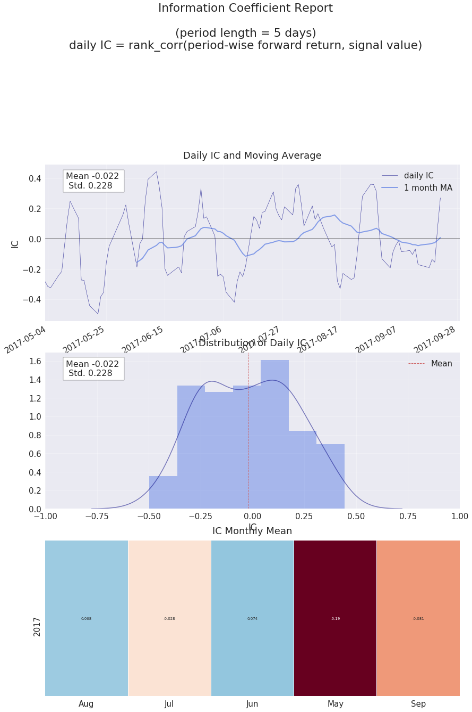
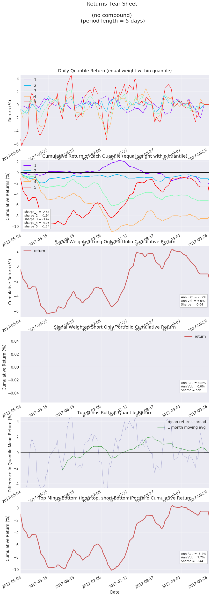

# SignalDigger
SignalDigger是digger模块中的一个核心类，使用SigalDigger可以分析股票单因子各项表现

*** 步骤 ***
1. 实例化SignalDigger-指定因子绩效表现的输出路径和输出格式
2. 因子数据预处理-通常跟dataview结合使用
2. 进行因子研究和分析

# step 1 实例化SignalDigger-指定因子绩效表现的输出路径和输出格式


```python
import warnings
warnings.filterwarnings('ignore')
```


```python
from jaqs_fxdayu.research import SignalDigger

# step 1：实例化SignalDigger 通过output_folder和output_format指定因子绩效表现的输出路径和输出格式
sd = SignalDigger(output_folder=".", output_format='pdf')
```

# step 2 因子数据预处理

## process_signal_before_analysis

- ` jaqs_fxdayu.research.signaldigger.digger.SignalDigger.process_signal_before_analysis(*args, **kwargs) `

**简要描述：**

- 将因子数据处理成signal_data--包含了因子及相关收益、quantile分组、涨跌空间等评价维度的综合数据(pandas.MultiIndex)

**参数：**


|参数名|必选|类型|说明|
|:----    |:---|:----- |-----   |
|signal|是  |pandas.DataFrame|因子值,日期为索引，股票品种为columns|
|price |是，price与ret二选一  |pandas.DataFrame|因子涉及到的股票的价格数据，用于作为进出场价用于计算收益,日期为索引，股票品种为columns|
|ret |是，price与ret二选一  |pandas.DataFrame| 因子涉及到的股票的持有期收益，日期为索引，股票品种为columns|
|benchmark_price | 否  |pandas.DataFrame or pandas.Series|基准价格，日期为索引。在price参数不为空的情况下，该参数生效，用于计算因子涉及到的股票的持有期**相对收益**--相对基准。默认为空，为空时计算的收益为**绝对收益**。|
|high |否  |pandas.DataFrame|因子涉及到的股票的最高价数据,用于计算持有期潜在最大上涨收益,日期为索引，股票品种为columns,默认为空|
|low |否  |pandas.DataFrame|因子涉及到的股票的最低价数据,用于计算持有期潜在最大下跌收益,日期为索引，股票品种为columns,默认为空|
|group |否  |pandas.DataFrame|因子涉及到的股票的分组(行业分类),日期为索引，股票品种为columns,默认为空|
|period |否  |int|持有周期,默认为5,即持有5天|
|n_quantiles |否  |int|根据每日因子值的大小分成n_quantiles组,默认为5,即将因子每天分成5组|
|mask |否  |pandas.DataFrame|一张由bool值组成的表格,日期为索引，股票品种为columns，表示在做因子分析时是否要对某期的某个品种过滤。对应位置为True则**过滤**（剔除）——不纳入因子分析考虑。默认为空，不执行过滤操作|
|can_enter |否  |pandas.DataFrame|一张由bool值组成的表格,日期为索引，股票品种为columns，表示某期的某个品种是否可以买入(进场)。对应位置为True则可以买入。默认为空，任何时间任何品种均可买入|
|can_exit |否  |pandas.DataFrame|一张由bool值组成的表格,日期为索引，股票品种为columns，表示某期的某个品种是否可以卖出(出场)。对应位置为True则可以卖出。默认为空，任何时间任何品种均可卖出|
|forward |否  |bool|收益对齐方式,forward=True则在当期因子下对齐下一期实现的收益；forward=False则在当期实现收益下对齐上一期的因子值。默认为True|
|commission |否 |float|手续费比例,每次换仓收取的手续费百分比,默认为万分之八0.0008|


**示例：**


```python
import numpy as np
from jaqs_fxdayu.data import DataView

# 加载dataview数据集
dv = DataView()
dataview_folder = './data'
dv.load_dataview(dataview_folder)

# 定义信号过滤条件-非指数成分
df_index_member = dv.get_ts('index_member')
mask = dv.get_ts('index_member') == 0  # 定义信号过滤条件-非指数成分

# 定义可买入卖出条件——未停牌、未涨跌停
trade_status = dv.get_ts('trade_status')
can_trade = ~(trade_status == u'停牌') # 未停牌
# 涨停
up_limit = dv.add_formula('up_limit', '(open - Delay(close, 1)) / Delay(close, 1) > 0.095', is_quarterly=False)
# 跌停
down_limit = dv.add_formula('down_limit', '(open - Delay(close, 1)) / Delay(close, 1) < -0.095', is_quarterly=False)
can_enter = np.logical_and(up_limit < 1, can_trade)  # 未涨停未停牌
can_exit = np.logical_and(down_limit < 1, can_trade)  # 未跌停未停牌
```

    Dataview loaded successfully.


```python
sd.process_signal_before_analysis(signal=dv.get_ts("pe"),
                                   price=dv.get_ts("close_adj"),
                                   high=dv.get_ts("high_adj"),
                                   low=dv.get_ts("low_adj"),
                                   group=dv.get_ts("sw1"),
                                   n_quantiles=5,
                                   mask=mask,
                                   can_enter=can_enter,
                                   can_exit=can_exit,
                                   period=5,
                                   benchmark_price=dv.data_benchmark,
                                   forward=True,
                                   commission=0.0008
                                   )
```

    Nan Data Count (should be zero) : 0;  Percentage of effective data: 85%


# step 3 进行因子研究和分析

## signal_data

- ` jaqs_fxdayu.research.signaldigger.digger.SignalDigger.signal_data `

**简要描述：**

- process_signal_before_analysis方法处理后的signal_data--包含了因子及相关收益、quantile分组、涨跌空间等评价维度的综合数据(pandas.MultiIndex)
- 需要执行process_signal_before_analysis后该属性才有值

**返回：**

trade_date+symbol为MultiIndex,columns为signal(因子)、return(持有期相对/绝对收益)、upside_ret(持有期潜在最大上涨收益)、downside_ret(持有期潜在最大下跌收益)、group(分组/行业分类)、quantile(按因子值分组)

**示例：**


```python
sd.signal_data.head()
```


<div>
<style>
    .dataframe thead tr:only-child th {
        text-align: right;
    }

    .dataframe thead th {
        text-align: left;
    }

    .dataframe tbody tr th {
        vertical-align: top;
    }
</style>
<table border="1" class="dataframe">
  <thead>
    <tr style="text-align: right;">
      <th></th>
      <th></th>
      <th>signal</th>
      <th>return</th>
      <th>upside_ret</th>
      <th>downside_ret</th>
      <th>group</th>
      <th>quantile</th>
    </tr>
    <tr>
      <th>trade_date</th>
      <th>symbol</th>
      <th></th>
      <th></th>
      <th></th>
      <th></th>
      <th></th>
      <th></th>
    </tr>
  </thead>
  <tbody>
    <tr>
      <th rowspan="5" valign="top">20170503</th>
      <th>000001.SZ</th>
      <td>6.7925</td>
      <td>-0.005637</td>
      <td>-0.003045</td>
      <td>-0.042326</td>
      <td>480000</td>
      <td>1</td>
    </tr>
    <tr>
      <th>000002.SZ</th>
      <td>10.0821</td>
      <td>0.011225</td>
      <td>0.016697</td>
      <td>-0.029432</td>
      <td>430000</td>
      <td>1</td>
    </tr>
    <tr>
      <th>000008.SZ</th>
      <td>42.9544</td>
      <td>-0.049408</td>
      <td>0.000463</td>
      <td>-0.092972</td>
      <td>640000</td>
      <td>4</td>
    </tr>
    <tr>
      <th>000009.SZ</th>
      <td>79.4778</td>
      <td>-0.069822</td>
      <td>0.009714</td>
      <td>-0.095426</td>
      <td>510000</td>
      <td>5</td>
    </tr>
    <tr>
      <th>000027.SZ</th>
      <td>20.4542</td>
      <td>-0.019517</td>
      <td>0.009404</td>
      <td>-0.041616</td>
      <td>410000</td>
      <td>2</td>
    </tr>
  </tbody>
</table>
</div>


## benchmark_ret

- ` jaqs_fxdayu.research.signaldigger.digger.SignalDigger.benchmark_ret `

**简要描述：**

- 基准收益
- 需要执行process_signal_before_analysis且传入了benchmark_price后该属性才有值

**示例：**


```python
sd.benchmark_ret.tail()
```


<div>
<style>
    .dataframe thead tr:only-child th {
        text-align: right;
    }

    .dataframe thead th {
        text-align: left;
    }

    .dataframe tbody tr th {
        vertical-align: top;
    }
</style>
<table border="1" class="dataframe">
  <thead>
    <tr style="text-align: right;">
      <th></th>
      <th>close</th>
    </tr>
    <tr>
      <th>trade_date</th>
      <th></th>
    </tr>
  </thead>
  <tbody>
    <tr>
      <th>20170925</th>
      <td>-0.006597</td>
    </tr>
    <tr>
      <th>20170926</th>
      <td>-0.002958</td>
    </tr>
    <tr>
      <th>20170927</th>
      <td>-0.005527</td>
    </tr>
    <tr>
      <th>20170928</th>
      <td>-0.003981</td>
    </tr>
    <tr>
      <th>20170929</th>
      <td>-0.000320</td>
    </tr>
  </tbody>
</table>
</div>


## ret

- ` jaqs_fxdayu.research.signaldigger.digger.SignalDigger.ret `

**简要描述：**

- 因子相关股票池的收益信息
- 需要执行process_signal_before_analysis且传入了benchmark_price后该属性才有值

**返回：**

由股票池各股票的return、upside_ret、downside_ret所组成的字典(dict)

**示例：**


```python
print(sd.ret.keys())
sd.ret["return"].head()
```

    dict_keys(['return', 'upside_ret', 'downside_ret'])


<div>
<style>
    .dataframe thead tr:only-child th {
        text-align: right;
    }

    .dataframe thead th {
        text-align: left;
    }

    .dataframe tbody tr th {
        vertical-align: top;
    }
</style>
<table border="1" class="dataframe">
  <thead>
    <tr style="text-align: right;">
      <th>symbol</th>
      <th>000001.SZ</th>
      <th>000002.SZ</th>
      <th>000008.SZ</th>
      <th>000009.SZ</th>
      <th>000027.SZ</th>
      <th>000039.SZ</th>
      <th>000060.SZ</th>
      <th>000061.SZ</th>
      <th>000063.SZ</th>
      <th>000069.SZ</th>
      <th>...</th>
      <th>601988.SH</th>
      <th>601989.SH</th>
      <th>601992.SH</th>
      <th>601997.SH</th>
      <th>601998.SH</th>
      <th>603000.SH</th>
      <th>603160.SH</th>
      <th>603858.SH</th>
      <th>603885.SH</th>
      <th>603993.SH</th>
    </tr>
    <tr>
      <th>trade_date</th>
      <th></th>
      <th></th>
      <th></th>
      <th></th>
      <th></th>
      <th></th>
      <th></th>
      <th></th>
      <th></th>
      <th></th>
      <th></th>
      <th></th>
      <th></th>
      <th></th>
      <th></th>
      <th></th>
      <th></th>
      <th></th>
      <th></th>
      <th></th>
      <th></th>
    </tr>
  </thead>
  <tbody>
    <tr>
      <th>20170502</th>
      <td>-0.012748</td>
      <td>-0.009400</td>
      <td>-0.060645</td>
      <td>-0.042922</td>
      <td>-0.015162</td>
      <td>-0.032807</td>
      <td>0.005199</td>
      <td>0.000423</td>
      <td>-0.006402</td>
      <td>-0.011290</td>
      <td>...</td>
      <td>0.023618</td>
      <td>-0.049392</td>
      <td>-0.113737</td>
      <td>0.001664</td>
      <td>0.007408</td>
      <td>-0.016581</td>
      <td>0.013146</td>
      <td>-0.019445</td>
      <td>-0.012823</td>
      <td>-0.022670</td>
    </tr>
    <tr>
      <th>20170503</th>
      <td>-0.005637</td>
      <td>0.011225</td>
      <td>-0.049408</td>
      <td>-0.069822</td>
      <td>-0.019517</td>
      <td>-0.057451</td>
      <td>-0.017162</td>
      <td>-0.013408</td>
      <td>-0.035379</td>
      <td>0.005009</td>
      <td>...</td>
      <td>0.035464</td>
      <td>-0.061670</td>
      <td>-0.116677</td>
      <td>0.025755</td>
      <td>0.017915</td>
      <td>-0.040529</td>
      <td>-0.037061</td>
      <td>-0.045260</td>
      <td>-0.031050</td>
      <td>-0.052526</td>
    </tr>
    <tr>
      <th>20170504</th>
      <td>0.008647</td>
      <td>0.024790</td>
      <td>-0.045152</td>
      <td>-0.080454</td>
      <td>-0.047912</td>
      <td>-0.047729</td>
      <td>-0.012925</td>
      <td>-0.045922</td>
      <td>-0.016502</td>
      <td>0.000723</td>
      <td>...</td>
      <td>0.038719</td>
      <td>-0.050292</td>
      <td>-0.126928</td>
      <td>0.029239</td>
      <td>0.030259</td>
      <td>-0.050401</td>
      <td>-0.031111</td>
      <td>-0.062009</td>
      <td>-0.055990</td>
      <td>-0.030355</td>
    </tr>
    <tr>
      <th>20170505</th>
      <td>0.029650</td>
      <td>0.025362</td>
      <td>-0.026835</td>
      <td>-0.070643</td>
      <td>-0.053107</td>
      <td>-0.004268</td>
      <td>-0.027992</td>
      <td>-0.053341</td>
      <td>-0.022091</td>
      <td>0.017399</td>
      <td>...</td>
      <td>0.035087</td>
      <td>-0.052918</td>
      <td>-0.122614</td>
      <td>0.062180</td>
      <td>0.049734</td>
      <td>-0.048412</td>
      <td>-0.018459</td>
      <td>-0.070290</td>
      <td>-0.086487</td>
      <td>-0.036765</td>
    </tr>
    <tr>
      <th>20170508</th>
      <td>0.021017</td>
      <td>0.034281</td>
      <td>-0.005983</td>
      <td>-0.055006</td>
      <td>-0.039849</td>
      <td>-0.007500</td>
      <td>-0.039059</td>
      <td>-0.067527</td>
      <td>0.011253</td>
      <td>0.028046</td>
      <td>...</td>
      <td>0.012388</td>
      <td>-0.043975</td>
      <td>-0.049807</td>
      <td>0.065397</td>
      <td>0.021249</td>
      <td>-0.051913</td>
      <td>-0.048080</td>
      <td>-0.054598</td>
      <td>-0.077470</td>
      <td>-0.038463</td>
    </tr>
  </tbody>
</table>
<p>5 rows × 330 columns</p>
</div>


## create_information_report

- ` jaqs_fxdayu.research.signaldigger.digger.create_information_report() `

**简要描述：**

- ic分析
- 需要执行process_signal_before_analysis后才能执行该方法

**返回：**

ic分析结果，并将结果保存至预设目录

**示例：**


```python
%matplotlib inline
sd.create_information_report()
```

    Information Analysis
                    ic
    IC Mean     -0.022
    IC Std.      0.228
    t-stat(IC)  -0.978
    p-value(IC)  0.331
    IC Skew      0.052
    IC Kurtosis -1.054
    Ann. IR     -0.097
    Figure saved: /home/xinger/Desktop/jaqs_plus/jaqs-fxdayu/docs/_source/information_report.pdf


    <matplotlib.figure.Figure at 0x7fcb9a277ac8>





## ic_report_data

- ` jaqs_fxdayu.research.signaldigger.digger.ic_report_data `

**简要描述：**

- ic分析相关数据
- 需要执行create_information_report后该属性才有值

**返回：**

由'daily_ic'，'monthly_ic'所组成的字典(dict)

**示例：**


```python
print(sd.ic_report_data.keys())
sd.ic_report_data["daily_ic"].head()
```

    dict_keys(['daily_ic', 'monthly_ic'])


<div>
<style>
    .dataframe thead tr:only-child th {
        text-align: right;
    }

    .dataframe thead th {
        text-align: left;
    }

    .dataframe tbody tr th {
        vertical-align: top;
    }
</style>
<table border="1" class="dataframe">
  <thead>
    <tr style="text-align: right;">
      <th></th>
      <th>ic</th>
    </tr>
    <tr>
      <th>trade_date</th>
      <th></th>
    </tr>
  </thead>
  <tbody>
    <tr>
      <th>2017-05-03</th>
      <td>-0.283985</td>
    </tr>
    <tr>
      <th>2017-05-04</th>
      <td>-0.317086</td>
    </tr>
    <tr>
      <th>2017-05-05</th>
      <td>-0.324241</td>
    </tr>
    <tr>
      <th>2017-05-08</th>
      <td>-0.239354</td>
    </tr>
    <tr>
      <th>2017-05-09</th>
      <td>-0.216610</td>
    </tr>
  </tbody>
</table>
</div>


## create_returns_report

- ` jaqs_fxdayu.research.signaldigger.digger.create_returns_report() `

**简要描述：**

- 收益分析
- 需要执行process_signal_before_analysis后才能执行该方法

**返回：**

收益分析结果，并将结果保存至预设目录

**示例：**


```python
sd.create_returns_report()
```

    Figure saved: /home/xinger/Desktop/jaqs_plus/jaqs-fxdayu/docs/_source/returns_report.pdf


    <matplotlib.figure.Figure at 0x7fcb6b38a550>





## returns_report_data

- ` jaqs_fxdayu.research.signaldigger.digger.returns_report_data `

**简要描述：**

- 收益分析相关数据
- 需要执行create_returns_report后该属性才有值

**返回：**

由'period_wise_quantile_ret'，'cum_quantile_ret','cum_long_ret','cum_short_ret', 'period_wise_tmb_ret', 'cum_tmb_ret'所组成的字典(dict)
分别对应：各quantile每日收益,quantile累积收益,多头组合（按因子值大小加权做多因子值为正的）累积收益,空头组合（按因子值大小加权做空因子值为负的）累积收益，多空组合（等权做多quantile最大组、做空quantile最小组）每日收益、多空组合（等权做多quantile最大组、做空quantile最小组）累积收益

**示例：**


```python
print(sd.returns_report_data.keys())
sd.returns_report_data['cum_quantile_ret'].head()
```

    dict_keys(['period_wise_quantile_ret', 'cum_quantile_ret', 'cum_long_ret', 'cum_short_ret', 'period_wise_tmb_ret', 'cum_tmb_ret'])


<div>
<style>
    .dataframe thead tr:only-child th {
        text-align: right;
    }

    .dataframe thead th {
        text-align: left;
    }

    .dataframe tbody tr th {
        vertical-align: top;
    }
</style>
<table border="1" class="dataframe">
  <thead>
    <tr style="text-align: right;">
      <th></th>
      <th>1</th>
      <th>2</th>
      <th>3</th>
      <th>4</th>
      <th>5</th>
    </tr>
    <tr>
      <th>trade_date</th>
      <th></th>
      <th></th>
      <th></th>
      <th></th>
      <th></th>
    </tr>
  </thead>
  <tbody>
    <tr>
      <th>2017-05-03</th>
      <td>-0.000403</td>
      <td>-0.001536</td>
      <td>-0.002002</td>
      <td>-0.001690</td>
      <td>-0.010550</td>
    </tr>
    <tr>
      <th>2017-05-04</th>
      <td>-0.000896</td>
      <td>-0.003169</td>
      <td>-0.004793</td>
      <td>-0.004698</td>
      <td>-0.023262</td>
    </tr>
    <tr>
      <th>2017-05-05</th>
      <td>-0.001330</td>
      <td>-0.005273</td>
      <td>-0.007637</td>
      <td>-0.008967</td>
      <td>-0.034614</td>
    </tr>
    <tr>
      <th>2017-05-08</th>
      <td>-0.002298</td>
      <td>-0.007992</td>
      <td>-0.009366</td>
      <td>-0.012054</td>
      <td>-0.044011</td>
    </tr>
    <tr>
      <th>2017-05-09</th>
      <td>-0.003656</td>
      <td>-0.010253</td>
      <td>-0.010315</td>
      <td>-0.015345</td>
      <td>-0.051984</td>
    </tr>
  </tbody>
</table>
</div>


## create_full_report

- ` jaqs_fxdayu.research.signaldigger.digger.create_full_report() `

**简要描述：**

- 收益分析+ic分析
- 需要执行process_signal_before_analysis后才能执行该方法

**返回：**

综合分析结果，并将结果保存至预设目录

**示例：**


```python
sd.create_full_report()
```
